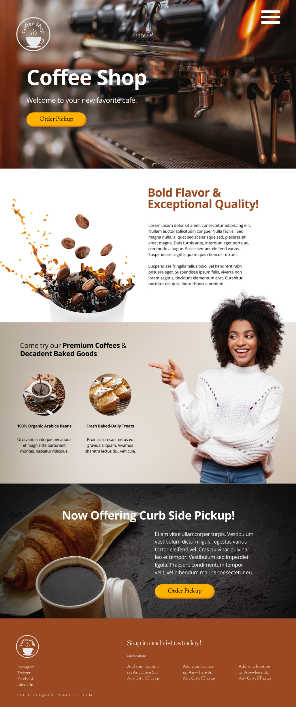

## Brukner Nature Center - Full Website Redesign

Brukner Nature Center is a nonprofit environmental education organization situated in Troy, Ohio. Alongside two peers, we completed a full website redesign aimed at strengthening the design, usability, and functionality of the site. Our redesign introduced a fresh visual identity and improved navigation, significantly enhancing user engagement and making educational content more accessible to the community.

View the [Live Website](https://www.bruknernaturecenter.com/){:target="_blank"}

<h3>Key Enhancements</h3>
<ul>
	<li>
		Website is now mobile responsive
	</li>
	<li>
		Improved overall user experience
	</li>
	<li>
		Enhanced aesthetic appeal
	</li>
	<li>
		Implemented custom SEO for increased traffic
	</li>
	<li>
		Website is now mobile responsive
	</li>
</ul>

## Other Design Projects
<!-- 1x3 gallery -->

		<a href="https://unsplash.com/@jeka_fe" target="_blank" class="gallery__link">
			<figure class="gallery__thumb">
				
				<figcaption class="gallery__caption">HTML & CSS Project for Social Media Wizard</figcaption>
			</figure>
		</a>

<a href="https://unsplash.com/@oladimeg" target="_blank" class="gallery__link">
			<figure class="gallery__thumb">
				
				<figcaption class="gallery__caption">Website Redesign Project for Brukner Nature Center</figcaption>
			</figure>
		</a>

<a href="https://unsplash.com/@oladimeg" target="_blank" class="gallery__link">
			<figure class="gallery__thumb">
				
				<figcaption class="gallery__caption">Passion Project for a Coffee Shop</figcaption>
			</figure>
		</a>

<!-- 2x2 gallery 

<ul>
	<li>
		<a href="img/wizard.png" target="_blank">
			<figure>
				
				<figcaption>The Social Media Wizard</figcaption>
			</figure>
		</a>
	</li>
	<li>
		<a href="img/bruknerredesign2022.png" target="_blank">
			<figure>
				
				<figcaption>Brukner Nature Center</figcaption>
			</figure>
		</a>
	</li>
	<li>
		<a href="img/coffeeshop.png" target="_blank">
			<figure>
				
				<figcaption>Coffee Shop</figcaption>
			</figure>
		</a>
	</li>
	<li>
		<a href="">
			<figure>
				
				<figcaption>Hiking trails</figcaption>
			</figure>
		</a>
	</li>
</ul>

-->

## Search Engine Optimization
Clark State College: [SEO Audit Report 2022]()

Brukner Nature Center: [SEO Keyword Anaylsis 2024]()

## Achievements & Certificates

Outstanding Student Award 2024 - Clark State College

[back](./)
