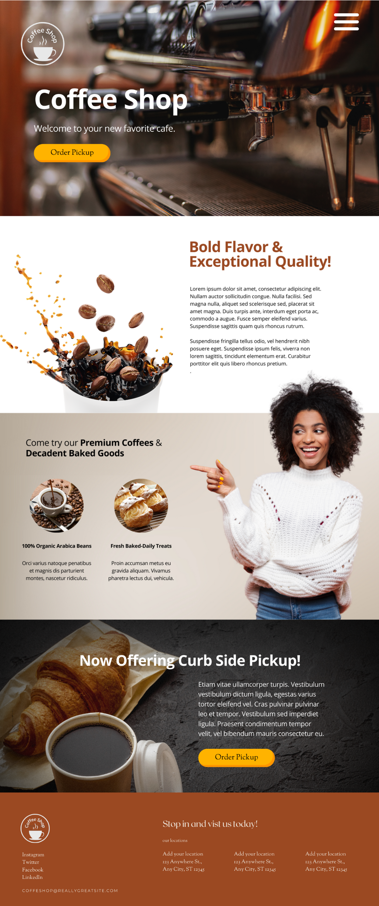

## Brukner Nature Center - Full Website Redesign

Brukner Nature Center is a nonprofit environmental education organization situated in Troy, Ohio. Alongside two peers, we completed a full website redesign aimed at strengthening the design, usability, and functionality of the site. Our redesign introduced a fresh visual identity and improved navigation, significantly enhancing user engagement and making educational content more accessible to the community.

<!-- Check out the [Live Website!](https://www.bruknernaturecenter.com/){:target="_blank"} -->

## Personal Portfolio Website
__Technologies Used:__ HTML, CSS, JavaScript
 
__Role:__ Designed and developed the personal portfolio website to showcase web design skills.
 
__Problem:__ Needed a platform to showcase web design and development work and resume for potential employers.
 
__Solution:__ Customized the Cayman theme on GitHub Pages and integrated custom HTML, CSS, and JavaScript to enhance the design.
 
__Outcome:__ Built a responsive, user-friendly portfolio that reflects a personal brand and showcases technical skills.

## Brukner Nature Center Website Redesign
 
[www.bruknernaturecenter.com](https://www.bruknernaturecenter.com/){:target="_blank"}
__Technologies Used:__ HTML, CSS, JavaScript, Squarespace
 
__Role:__ Scrum Master for a three-member team; contributed to redesigning the website and SEO.
 
__Problem:__ Website needed a more modern, user-friendly interface.
 
__Solution:__ Led the redesign, incorporating custom HTML, CSS, and JavaScript to improve navigation and mobile responsiveness.
 
__Outcome:__ Resulted in a modern, mobile-responsive site with improved customer engagement.

## eCommerce Website for Hot Sauce Company
__Technologies Used:__ HTML, CSS, JavaScript, PHP, MySQL
 
__Role:__ Full-stack developer working on both front-end and back-end features.
 
__Problem:__ The client needed an online platform to sell products.
 
__Solution:__ Developed a full-stack eCommerce platform with features like user authentication, shopping cart, and payment processing.

<!-- 
 -->

<!-- <i class="fa-solid fa-arrow-right"></i> -->
Check out the <a href="https://www.bruknernaturecenter.com/" target="_blank">Live Website!</a>
<h3>Key Enhancements</h3>
<ul>
	<li>
		Website is now mobile responsive
	</li>
	<li>
		Improved overall user experience
	</li>
	<li>
		Enhanced aesthetic appeal
	</li>
	<li>
		Implemented custom SEO for increased traffic
	</li>
</ul>

<!-- 
 -->

<video width="auto" height="400" autoplay loop muted>
  <source src="bruknerdemo.mp4" type="video/mp4">
</video>

## Other Design Projects
<!-- 1x3 gallery -->

		<a href="img/wizard.png" target="_blank" class="gallery__link">
			<figure class="gallery__thumb">
				
				<figcaption class="gallery__caption">HTML & CSS Homepage for Social Media Wizard</figcaption>
			</figure>
		</a>

<a href="img/bruknerredesign2022.png" target="_blank" class="gallery__link">
			<figure class="gallery__thumb">
				
				<figcaption class="gallery__caption">Redesign Proposal for Brukner Nature Center</figcaption>
			</figure>
		</a>

<a href="img/coffeeshop.png" target="_blank" class="gallery__link">
			<figure class="gallery__thumb">
				
				<figcaption class="gallery__caption">Passion Project for a Coffee Shop</figcaption>
			</figure>
		</a>

 

## Search Engine Optimization

Clark State College: [SEO Audit Report](./clarkstateseo.pdf){:target="_blank"}

Brukner Nature Center: [SEO Keyword Anaylsis](./bruknerseo.pdf){:target="_blank"}

 

## Achievements & Certificates

**Outstanding Student Award**, from Clark State College - 2024

**Social Media Marketing Certificate**, from Clark State College - 2021

**New Media Certificate**, from Clark State College -  2021

 

[back](./)
